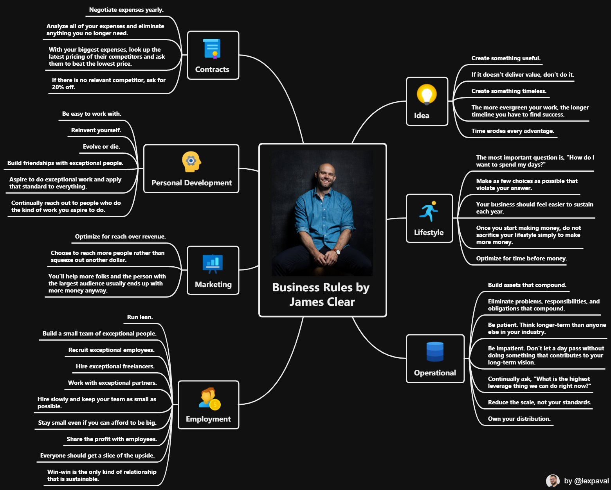

# Business

Es ist sinnvoller Geld in die Entwicklung eines großartigen Produktes zu stecken als in Marketing.
Beispiel:
- Betriko
- Tesla
Wenn man ein fantastisches Produkt hat, machen die Käufer die Werbung.
[Teslas secret weapon](https://www.youtube.com/watch?v=XgtXped_w4s)
- Geschäftsmodell: Vertrauen
- keine Kosten für die Umwelt produzieren
- geringe Kosten
- Mitarbeiter gut bezahlen
- sehr gutes Produkt 
- wenige Varianten

Es sollte viele kleine Teams geben, die sich mit bestimmten Themen beschäftigen. Ab 6-10 Personen pro Team wird es schwieriger sich abzustimmen. Verschiedene Teams suchen die beste Lösung für ein Problem und "treten gegeneinander an".

[So](./starten.md) würde ich eine Firma aufbauen

## Regeln



## Zielgruppe aufbauen

- Gelerntes Veröffentlichen (Blog, Videos, ...)
- Kostenlos Mehrwert liefern
- Am Anfang sehr enges Themengebiet, dann langsam ausweiten

### Links

- [How I Started a $400,000 Side Business in 1 Month (for Free)](https://www.youtube.com/watch?v=NblHMZbYg-o)
- [Best Book On Doing Online Business](https://cortes.site/best-book-on-doing-online-business/)
- [How to Crush it on Twitter](https://www.youtube.com/watch?v=P5d6zm3YbqM)
- [Audience-First Products](https://perell.com/essay/audience-first-products/)

## Nutzer

Nutzer so lange wie möglich individuell betreuen. Besonders am Anfang ist es sinnvoll die Nutzer abzuholen, ihnen alles zu zeigen und Feedback zu bekommen. 

Ich möchte eine Beziehung zu meinen Nutzern aufbauen und gemeinsam ein besseres Produkt entwickeln.

## Preise

Die Preise für enge Freunde sehr gering halten (Selbstkosten?), die Freunde meiner Freunde zahlen etwas mehr, deren Freunde zahlen den vollen Preis.

Meine Freunde und deren Freunde werden meine Geschäft empfehlen. So kann ich sehr effizientes Marketing aufbauen. Die Leute vertrauen den Empfehlungen von Freunden eher als der Werbung.

Selbst wenn nur ein kleiner Teil der Freunde relevant für mein Produkt (z.B. 10) ist, kann ich schnell viele Personen erreichen:

```
10 * 10 * 10 = 1.000 Personen
```

## Verwaltung

Ziel: Den Wasserkopf so klein wie möglich halten, um sich auf die Kernaufgabe des Unternehmens konzentrieren zu können

- Papierlos
- so viel wie möglich digitalisieren
- Automatisierung

### Links

- [Show Up Every Day for Two Years](https://seanwes.com/2015/show-up-every-day-for-two-years/)
- [Jesus Marketing](https://taylorpearson.me/jesusmarketing/)
- [Die 4 einzigen Wege, um mit deinem Blog wirklich Geld zu verdienen](https://www.chimpify.de/marketing/wege-um-mit-blog-geld-zu-verdienen/)
- [Was ist ein Tribe und warum ist er so wichtig?](https://www.chimpify.de/marketing/warum-tribe-wichtig/)

## Zitate

> If you want to Go fast Go alone, if you want to Go far go together.

> "With Product-led Growth, the idea is that rather than bringing users through an active sales team or aggressive marketing campaigns, you just focus on building your product - and ensure you make it great." - (Why You May Not Need a Sales Team)[https://posthog.com/blog/product-led-growth]

## Inspiration

- [Mid-Year Review](https://perell.com/essay/mid-year-review/)

### Produkte

- [Marvin](https://amazingmarvin.com/pricing) - Fokus auf User und großartiges Produkt (Pricing Questions)

### Launch

- [Introducing Colossus](https://joincolossus.com/blog/posts/introducing-colossus)

## Journey

- [Tailwind CSS: From Side-Project Byproduct to Multi-Million Dollar Business](Tailwind CSS: From Side-Project Byproduct to Multi-Million Dollar Business)
- [This is the blueprint I've followed to build my own business/income in ~4 years](https://twitter.com/jdnoc/status/1291773397010087938)
- [A Bootstrapped SaaS Journey to 10K MRR](https://www.bannerbear.com/journey-to-10k-mrr/)
- [Building a business from a bedroom](https://www.mrdbourke.com/running-a-business-from-a-bedroom-11-months-in/)
- [A solo journey to 100k](https://draculatheme.com/pro/journey)
- [How a Czech DJ Built a 3D Printing Empire](https://www.freecodecamp.org/news/how-prusa3d-became-one-of-the-fastest-growing-startups-in-the-world/)
- [How Josh Comeau pulled off a $500.000 Course Launch](https://renenauheimer.substack.com/p/how-josh-comeau-pulled-off-a-500000)

## Links

- [Be Good](http://paulgraham.com/good.html)
- [Your First 60 Days](https://microconf.gen.co/patrick-mckenzie/)
- [Pre-Brand](https://pre-brand.com/) - You don’t need a perfect brand, you need to keep moving
- [How I side project](https://thesephist.com/posts/how-i-side-project/)
- [How to finish your side project](https://hugozap.com/posts/how-to-finish-your-side-project/)
- [How To Sell](https://nabeelqu.co/post-selling)
- [Making a living as an independent maker](https://twitter.com/adamwathan/status/1296447318074568704)
- [Love flywheels? You're in luck!](https://twitter.com/lennysan/status/1295743085243060224)
- [Postmake](https://postmake.io/) - Tools and resources for your startups
- [Making The Leap](https://www.coreyhaines.co/blog/leap)
- [Microsolidarity Part 2](https://medium.com/microsolidarity/microsolidarity-part-2-a-theory-of-groups-and-groups-of-groups-7c6e7ce63eda)
- [building an audience](https://twitter.com/thisiskp_/status/1306614299218055169)
- [How to build a products](https://twitter.com/jackbutcher/status/1316747172306616321)
- [Never Compete on Price](https://medium.com/@tylerhakes/never-compete-on-price-c7709f29280)
- [Blogging for Devs](https://bloggingfordevs.com/)
- [23 rules to run a software startup with minimum hassle](https://www.joisig.com/rules-software-startup-minimum-hassle)
- [Growth Marketing](https://www.julian.com/guide/growth/intro)
- [Audience First](https://audiencefirst.link/contents/)
- [Selling digital products using Laravel](https://freek.dev/1789-selling-digital-products-using-laravel-part-1-intro-a-tour-of-spatiebe)
- [How to Make Sure Your Product Launch SELLS](https://www.youtube.com/watch?v=LSrcELpdgX8)
- [Finances needed to indie (2020)](https://twitter.com/yongfook/status/1328158466645475328)
- [What piece of financial advice is hard to explain to others?](https://qr.ae/pN9peS)
- [PopUp Business School](https://www.popupbusinessschool.co.uk/)
- [The 70% Rule](https://taylorpearson.me/fast/)
- [EntepreNERD](https://www.jackkinsella.ie/books/entreprenerd/marketing_for_programmers) - Marketing for programmers 
- [The Math That Explains How to Get Rich with Websites](https://fourpillarfreedom.com/website-math/)
- [How do I build something people want?](https://justinjackson.ca/build)
- [Why You Should Share Your Ideas Online](https://stewfortier.com/why-you-should-share-your-ideas-online)
- [Referral program Loom](https://twitter.com/_shahedk/status/1367532457075957761)
- [The easiest way to make $9,000 every month.](https://twitter.com/ImSamThompson/status/1367557220469211144)
- [landing page examples](https://twitter.com/mrsharma/status/1367301523710103557)
- [This Is the Secret to Business and Artistic Success](https://ryanholiday.net/secret-to-success/)
- [Ideas are just a multiplier of execution](https://sive.rs/multiply)
- [Honesty](https://stitcher.io/blog/honesty)
- [My Principles of Company Building](https://perell.com/essay/principles-of-company-building/)
- [Create additional revenue streams](https://twitter.com/johndsaunders/status/1379390180445065219)
- [Do things that don't scale](http://paulgraham.com/ds.html)

### Blogs

### Videos

- [Josh Pigford - From Idea to $5k/mo in 5 Months](https://vimeo.com/94623532)
- [Starting a $400,000 Side Business in 1 Month](https://www.youtube.com/watch?v=NblHMZbYg-o)
- [How This CEO Built a Billion-Dollar Ethical Egg Business](https://www.youtube.com/watch?v=o8uhxZON1TU)