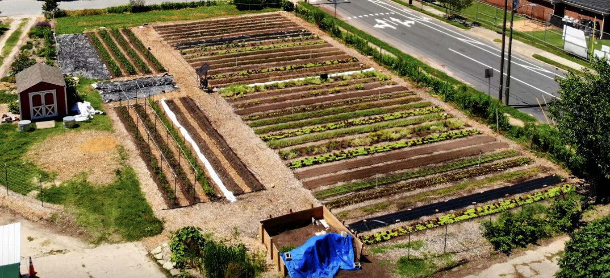

# Anlegen

## Wege

- Hackschnitzel: pilzdominiert -> gut für Bäume
- Pilze in Hackschnitzel züchten

## Beete

- Kompost: bakteriendominiert -> gut für Gemüse
- Standardisierte Größe (an Werkzeuge anpassen)

[The Ultimate No-Till Strategy](https://www.youtube.com/watch?v=0OQkVuKOAoQ)
