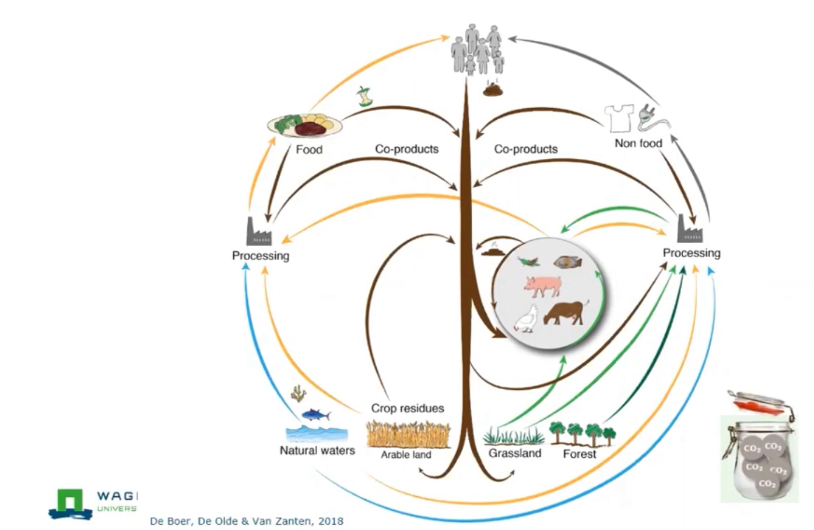

# Landwirtschaft

Die Landwirte sollen Produkte direkt an die Kunden verkaufen, damit sie von der ganzen Wertschöpfung profitieren können und nicht in Abhängigkeit der Industrie, die die Preise diktiert, geraten.

Dazu soll grßer Wert auf die Qualität der Produkte und der Produktionsmethoden gelegt werden.

Die Produktion soll regenerativ sein und zum Wohl aller beitragen.
- Permakultur
- Regenerative Landwirtschaft

Anstatt sich zu spezialisieren sollen viele verschiedene [Produkte](./produktion.md) produziert werden, um Synergieeffekte zwischen den Lebewesen zu nutzen und ihre Besonderheiten beachtet werden.

- Sicherheit durch Diversifikation

Die Abfallprodukte aus einer Produktion sollen als Input für eine andere dienen, wie in der Natur. Es soll eine Kreislaufwirtschaft entstehen.

Es soll eine komplette Ernährung für die Anwohner produziert werden:

- Gemüse
- Fisch & Fleisch
- Milch
- Obst
- Nüsse
- Getreide
- ...

Die Produktion soll auch in der Nähe der Anwohner stattfinden. Das minimiert Transportwege und es entsteht wieder eine Verbindung zwischen dem Landwirt und den Anwohnern. 

## Vorbilder

- [Polyface Farm](https://www.polyfacefarms.com/)
- [Richard Perkins](https://www.youtube.com/user/mrintegralpermanence)
- [Gabe Brown](http://brownsranch.us/soil-health/)

## Circular Agriculture

[Universität Wageningen - Dr. Saskia Visser](https://www.youtube.com/watch?v=FS6YsibNXic)

- Ackerbau nur für Menschen
- Tierhaltung auf Weiden + Lebensmittelreste, Prozessabfälle
- Alle Abfallstoffe zurück in den Kreislauf führen

## Umsetzung

### Obstwiese

Obstwiese mit Weideflächen für Weidehähnchen und Kaninchen

### Garten

- Marktgarten
- Hühner zur Kompostproduktion
- Gewächshaus
    + Sommer: Gemüse
    + Winter: Stall

### Teich

- Fische 
- Enten

### Weide

- Tagesweide
- Rinder / Kühe (1. Tag)
- Schafe (2. Tag)
- Hühner (4. Tag)

Das selbe Stück Land wird nacheinander von mehreren Tierarten genutzt. Sie ergänzen sich dabei gegenseitig.

### Wald

- Nüsse, Buchen, Eicheln, Kastanien (Nutzholz + Futter für Tiere)
- Schweinehaltung

### Kreislaufwirtschaft

- Unverkauftes als Futter verwenden, anststt es zu entsorgen
    + Brot / Brötchen
    + Obst / Gemüse
- Grünschnittannahme zur Hackschnitzelproduktion -> Kompost
