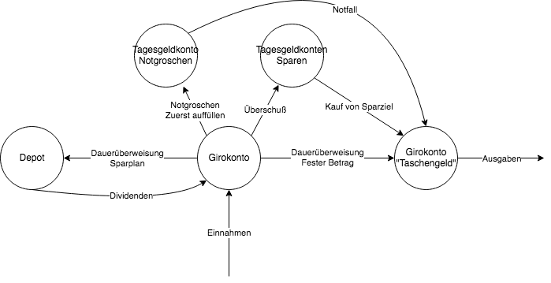

# Finanzen

## Struktur

### Ablauf

- Alle Einnahmen in Einnahmenkonto
- (Notgroschen auffüllen)
- Dauerauftrag -> Depot für Investment (Sparplan [Welt ETF](https://www.justetf.com/de/etf-profile.html?isin=IE00B3RBWM25&from=search))
- Dauerauftrag -> Ausgangskonto Taschengeld (Wohnen, Auto, Ernährung, ...) 
- Alle Ausgaben von Ausgangskonto -> Übersicht Ausgaben
- Rest:
    + Sparen
    + Depot

### Konten

- Eingangskonto
- Ausgangs- / Taschengeldkonto
- Depot 
- Tagesgeldkonto Notgroschen
- Tagesgeldkonten Sparen (Urlaub, Auto, ...)

### Investment

- Immer mindestens einen Teil der Gewinne reinvestieren
- Nur das notwendigste entnehmen / nie mehr als die Gewinne (Dividenden)

## Sonstiges

### Rechnungen 

- per Mail -> Weniger Müll
- per Lastschrift bezahlen

## Links

- [How to build wealth slowly](https://pjrvs.com/wealth)
- [Opportunity cost ](https://thewokesalaryman.com/2020/05/05/life-changing-economic-theories-applied-to-personal-finance/)
- [How to Build Profitable Websites from Scratch](https://fourpillarfreedom.com/the-income-community-how-to-build-profitable-websites-from-scratch/)

## Videos

- [How to Profit from a Recession](https://www.youtube.com/watch?v=mRHBrJziE-Y&t=503s)
