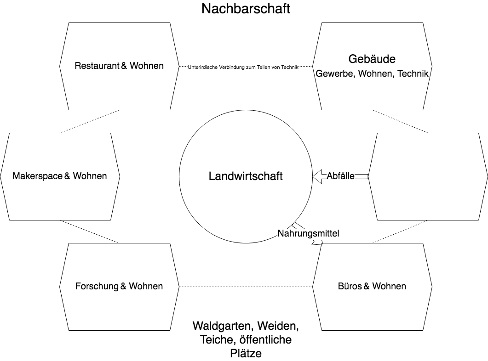
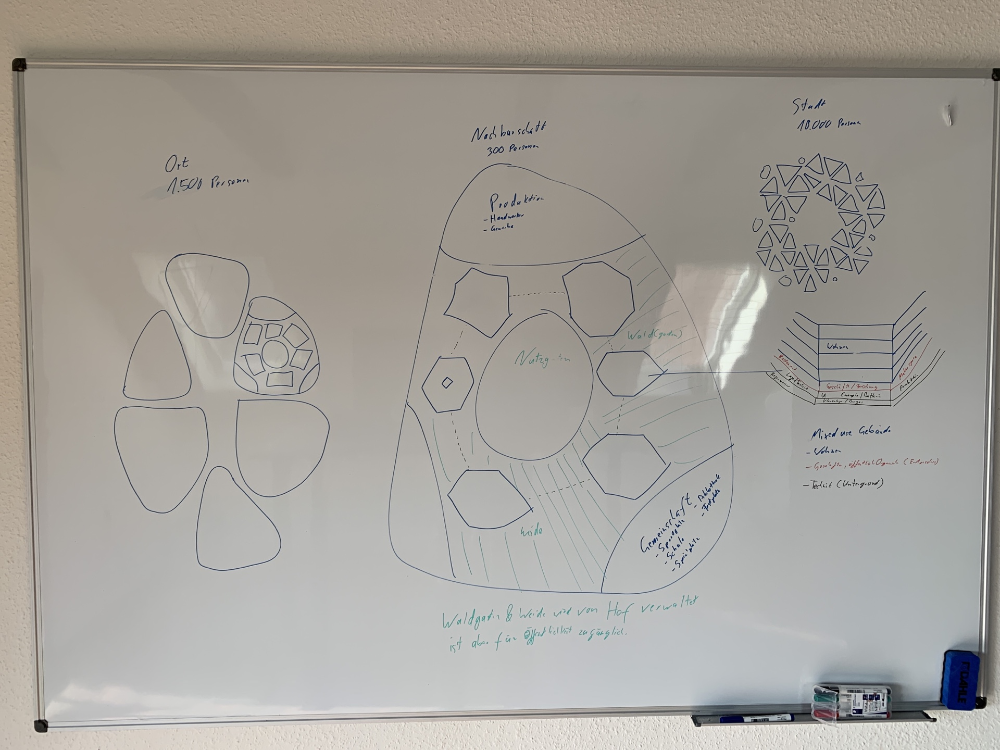

# Nachbarschaft

Ziel ist es eine lebenswerte Nachbarschaft in einem bestehenden Dorf zu kreieren, um die Zufriedenheit der Bewohner durch das Design der Umgebung zu erhöhen. Die Nachbarschaften sollen einen grünen Gürtel im Dorf bilden. So profitieren alle.

Stark inspiriert von [Oceanix](https://oceanix.org/)

Die [Landschaft](./landschaft.md) sollte von der Natur, besonders Wäldern, und wenigen großen Gebäuden geprägt sein.

[Hier](./start.md) habe ich einen möglichen Weg aufgeschrieben zum Start aufgeschrieben.

## Werte

| Gut | Schlecht |
| --- | -------- |
| Zufriedenheit | Materialismus |
| Gesundheit |Egoismus |
| Gemeinschaft | |
| Persönliche Entwicklung | |
| Naturschutz | |
| Bildung | |
| Forschung | |
| Toleranz | |

## Überblick

### Vorteile

- Gesunde Ernährung
- Animiert zu gesundem Lebensstil
- Soziale Kontakte
- Kontakt zur Natur
- Alles zu Fuß oder mit Fahrrad erreichen können

### Ausblick

Im Optimalfall sind am Ende alle Nachbarschaften verbunden. Das führt zu folgenden Vorteilen:
- Wander- / Laufwege
- kurze Wege -> Vieles kann zu Fuß / Fahrrad erreicht werden
- Waldgürtel durch Ort -> Erholung (Beispiel: Glacis Minden)
- Teilen von Ressourcen
    + Schule
    + Kindergarten
    + Arzt
    + Gemeinschaftsräume
    + Sportplatz

## Ernergieversorgung

Überbauen der regenerativen Energieversorgung, um konstante Versorgung zu ermöglichen.

### Strom

- Solaranlagen
- Windkraftanlagen
- Wasserkraft

### Stromspeicher

#### Gebäude

- Batterie

#### Nachbarschaft

- Wasserstoff (Brennstoffzelle)
    + aus überschüssigem Strom

#### Stadt

- Biogas
    + Methanogenese mit überschüssigem Wasserstoff
- Flüssigluftspeicher

### Wärme

- Wärmepumpe    
    + unterstützt durch Abwärme von Brennstoffzelle

## Abfälle

### Ausscheidungen

Trennung von fester und flüssiger Phase  
Fest -> kompostieren -> Dünger für Bäume
Flüssig -> Algenzucht? -> Fischfutter

### Organische Abfälle

- Kompostieren?
- Futter für Insekten? -> Insektenlarven -> Fischfutter
- Biogas?

### Holz

- Häckseln -> Mulch
- Kompostieren

