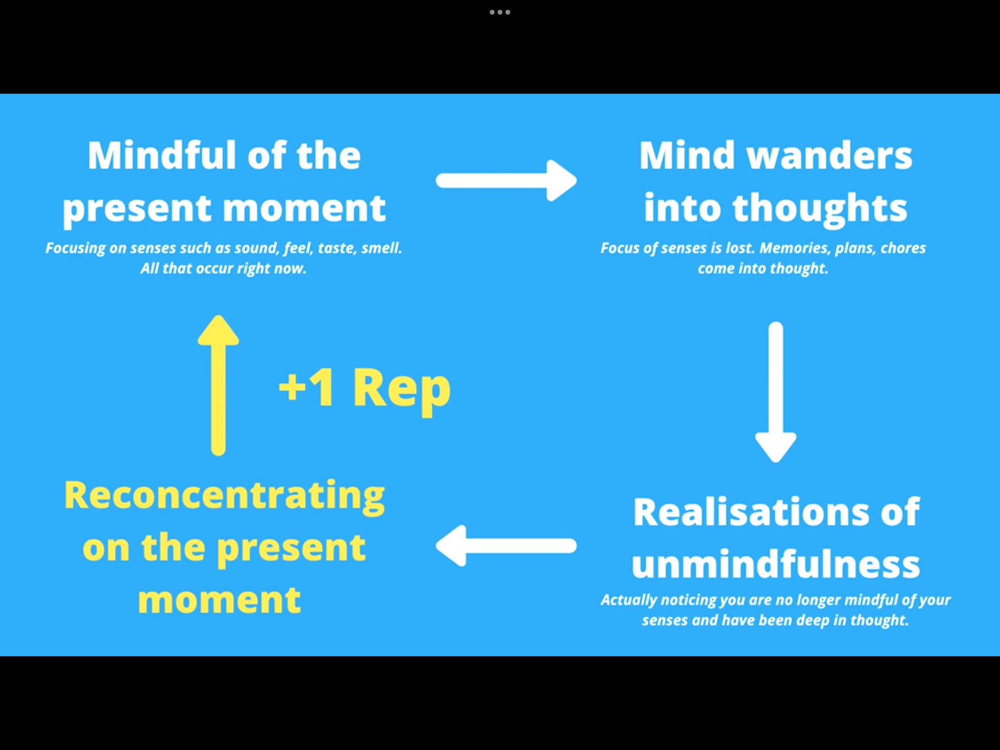

# Psyche

## Meditation

- Mit geschlossenen Augen auf die Atmung konzentrieren
- Geführte Meditation
    + spotify
    + [Das Meditieren beginnen](https://open.spotify.com/episode/1Cojh3ByBDQiHiRj6siyMI?si=oSXg9MiMTc2NYR0zGeYJ5A&nd=1)

    
### Effekte

- Stressreduktion
- Verbesserung der kognitiven Fähigkeiten
- Verbesserter Schlaf
- Steigert das Glücksempfinden
- Fördert die emotionale Gesundheit
- Verbessert die Selbstwahrnehmung
- Verlängert die Aufmerksamkeitsspanne
- Besseres Gedächtnis
- Kann den Blutdruck senken

#### Links

- [Meditation: 12 wissenschaftlich bewiesene Vorteile](https://www.brainperform.de/meditation-vorteile/)
- [Wie Achtsamkeit wirkt](https://www.spektrum.de/news/meditation-wie-achtsamkeit-wirkt/1940368#Echobox=1640676407)
    
## Aufmerksamkeit

- Dinge bewusst machen
- Keine Ablenkungen
- Im Moment sein und wahrnehmen

### Links

- 

## Sonnenschein

- Jeden Tag mindestens 30 Minuten draußen verbringen -> Vitamin D

## Spaß

- Kleine Dinge, die Freude machen über den Tag verteilen

## Innerer Kritiker

- "Ich" duch eigenen Namen ersetzen
- Distanz zu Problem schaffen
    + die Erfahrung mit anderen vergleichen
    + Ist es wirklich so schlimm wie es scheint?
- "Gefahren" als Herausforderungen sehen

[How to Be Happier Without Really Trying](https://www.bakadesuyo.com/2021/03/happier-without-really-trying/)

### Links

- [Your Two Minds](https://markmanson.net/your-two-minds)
- [Radiant vs Vacuous Self-Talk](https://www.youtube.com/watch?v=d8UlBlPtAE0)
- [How to Monitor Your Negative Thinking](https://www.theemotionmachine.com/rubber-band-technique-how-to-monitor-your-negative-thinking/)
- [Chatter: The Voice in Our Head, Why It Matters, and How to Harness It](https://www.goodreads.com/book/show/53330118-chatter)

## Gefühle

- Wut: Kraft um Dinge zu verändern
- Angst: Hilft das Unbekannte konfrontieren
- Trauer: Dinge, die man nicht kontrollieren kann, akzeptieren; Kontakt zu anderen Menschen
- Scham: Energie und Erkenntnis das Verhalten zu ändern
- Freude: Motiviert und zeigt, dass ein Zustand erstrebenswert ist

Gefühlskompass

## Links

- [How the ‘Magic: The Gathering’ Color Wheel Explains Humanity](https://humanparts.medium.com/the-mtg-color-wheel-c9700a7cf36d)
- [Psychological Facts That Will Blow Your Mind! - Rory Sutherland](https://www.youtube.com/watch?v=fuoDzMmoN2o)
- [6 Tips to Change Negative Thinking](https://www.verywellmind.com/how-to-change-negative-thinking-3024843)
- [Anxiety Is in Your Body, Not Your Mind](https://elemental.medium.com/anxiety-is-in-your-body-not-your-mind-93031abd14eb)
- [The 10 Must-Read Psychology Books Every Human Being Should Read](https://durmonski.com/reading-lists/must-read-psychology-books/)
- [What’s the best question your therapist has asked you?](https://www.reddit.com/r/AskWomen/comments/oqrm57/whats_the_best_question_your_therapist_has_asked/)
- [13 Steps to Cognitive “Perfection”](https://medium.com/future-literacy/13-steps-to-cognitive-perfection-86e316569c3f)
- [harsh Psychology truths](https://twitter.com/thebrometheus/status/1357419737278386179)
- [Grounding](http://hintjens.com/blog:81#toc12)
- [Mental Wealth](https://jjbeshara.com/2020/06/04/mental-wealth/)
- [Medito](https://meditofoundation.org/)

