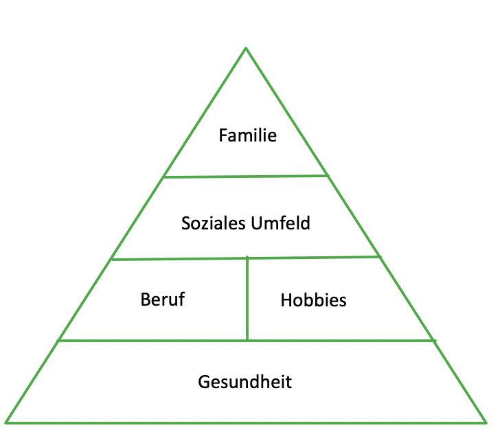
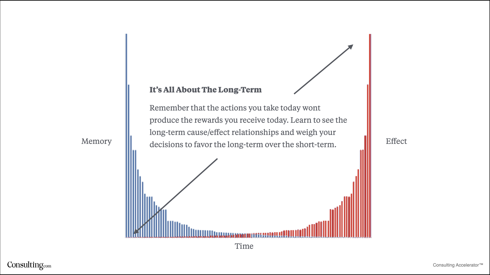

# Zufriedenheit

Ich glaube man benötigt sehr wenige Dinge, um ein zufriedenes Leben zu führen.

Nichts, was sich wirklich lohnt, ist einfach zu bekommen. Die Schwierigkeit es zu erreichen macht es wertvoll.

Indem ich Dinge produziere anstatt nur zu konsumieren bin ich zufriedener. Besonders, wenn es schwierig war etwas zu tun.

Ich glaube etwas Leiden gehört zu einem guten Leben dazu. Dadurch habe ich den Antrieb mein Leben zu verbessern und etwas zu tun. Entscheidend ist, dass ich es mir selbst aussuche. Es ist wichtig herauszufinden, wofür ich bereit bin Opfer zu bringen.

> “human beings need three basic things in order to be content: they need to feel competent at what they do; they need to feel authentic in their lives; and they need to feel connected to others. These values are considered "intrinsic" to human happiness and far outweigh "extrinsic" values such as beauty, money and status.” - [Tribe: On Homecoming and Belonging](https://www.goodreads.com/book/show/40940205-tribe)

> "Happiness = Reality - Expectitions" - [The Happiness Equation: Want Nothing + Do Anything = Have Everything](https://www.goodreads.com/book/show/22571656-the-happiness-equation)
-> Erwartungen senken führt zu mehr Zufriedenheit

Ich habe es selbst in der Hand mein Traumleben zu erschaffen!

- Glücklich sein: Nichts wollen, nichts bewerten, den Moment genießen
- Immer das Positive in allen Situationen sehen

## Perma

### Positive Emotion
### Engagement

#### Stärken

##### Weisheit und Wissen

kognitive Stärken, die den Erwerb und den Gebrauch von Wissen beinhalten

- Kreativität: Neue und effektive Wege finden, Dinge zu tun
- Neugier: Interesse an der Umwelt haben
- Urteilsvermögen und Aufgeschlossenheit: Dinge durchdenken und von allen Seiten betrachten
- Liebe zum Lernen: Neue Techniken erlernen und Wissen aneignen
- Weitsicht: In der Lage sein, guten Rat zu geben

##### Mut

Emotionale Stärken, die mittels der Ausübung von Willensleistung dabei helfen, interne und externe Barrieren zur Erreichung eines Zieles zu überwinden

- Tapferkeit (Mut): Sich nicht Bedrohung oder Schmerz beugen, sondern Herausforderungen annehmen
- Ausdauer (Hartnäckigkeit, Beharrlichkeit, Fleiss): Beenden, was begonnen wurde
- Ehrlichkeit (Integrität): Die Wahrheit sagen und sich natürlich verhalten
- Tatendrang (Vitalität): Der Welt mit Begeisterung und Energie begegnen

##### Menschlichkeit

Interpersonale Stärken, die liebevolle menschliche Interaktionen ermöglichen

- Fähigkeit zu lieben und geliebt zu werden: Menschliche Nähe herstellen und schätzen können
- Freundlichkeit (Grosszügigkeit): Gefallen tun und gute Taten vollbringen
- Soziale Intelligenz (soziale Kompetenz): Sich der eigenen Motive und Gefühle und denen anderer bewusst sein

##### Gerechtigkeit

Stärken, die das Gemeinwesen fördern

- Teamwork (Bürgerverantwortung, Teamfähigkeit): Gut als Mitglied eines Teams arbeiten
- Fairness: Alle Menschen nach dem Prinzip der Gleichheit und Gerechtigkeit behandeln
- Führungsvermögen: Gruppenaktivitäten organisieren und ermöglichen

##### Mässigung

Stärken, die Exzessen entgegenwirken

- Vergebungsbereitschaft und Gnade: Denen vergeben, die einem Unrecht getan haben
- Bescheidenheit und Demut: Das Erreichte für sich sprechen lassen
- Vorsicht (Besonnenheit, Umsicht): Nichts tun oder sagen, was später bereut werden könnte
- Selbstregulation: Regulieren, was man tut und fühlt

##### Transzendenz

Stärken, die uns einer höheren Macht näherbringen und Sinn stiften

- Sinn für das Schöne und Exzellenz: Schönheit in allen Lebensbereichen schätzen
- Dankbarkeit: Sich der guten Dinge bewusst sein und sie zu schätzen wissen
- Hoffnung (Optimismus): Das Beste erwarten und daran arbeiten, es zu erreichen
- Humor: Lachen und Humor schätzen und Leute gerne zum Lachen bringen
- Religiosität und Spiritualität: Kohärente Überzeugungen von einem höheren Sinn des Lebens haben

[Charakter](http://www.positive-psychologie.ch/?page_id=27)

### Relationships
### Meaning
### Accomplishment

[PERMA Theory of Well-Being](https://ppc.sas.upenn.edu/learn-more/perma-theory-well-being-and-perma-workshops)

## Ziele

Ich glaube die meisten Ziele, die von der Gesellschaft als erstrebenswert angesehen werden, führen nicht zu einem zufriedenen Leben.
Sie sind alle von äußeren Faktoren, die man oft nicht beeinflussen kann, abhängig.

Vieles beruht auch auf Neid. Aber um neidisch auf jemanden zu sein, muss ich das ganze Leben der Person in Betracht ziehen, nicht nur das Positive.
Wenn jemand sehr viel erreicht hat, wird er auch sehr viel dafür geopfert haben. Um der Beste in etwas zu werden, kann ich mich auf nichts anderes konzentrieren als die eine Sache. Darunter werden andere Teile meines Lebens leiden.

### Geld

Geld ist sehr wichtig, sollte aber als Werkzeug genutzt werden, um sein Leben zu verbessern nicht als Ziel an sich.  
[Finanzen](./finanzen/finanzen.md)

### Materialismus

Vieles wird nur gekauft, um andere zu beeindrucken. Wenn ich ganz ehrlich bin, brauche ich nur wenige Dinge wirklich.
Mit einem großen Haus muss ich auch mehr aufräumen, ich kaufe mehr Dinge, um das Haus zu füllen.

Außerdem hält das Glücksgefühl nachdem ich etwas gekauft habe nur kurz an. Ich gewöhne mich schnell an das Neue und bin wieder an der gleichen Stelle wie vorher.

#### Links

- [Joe Rogan - Avoid The Trap of Materialism If You Want To Succeed In LIFE](https://www.youtube.com/watch?v=q60LG8y3BHs)

### Ruhm

Es ist sehr schön von Menschen Anerkennung für etwas zu bekommen, dass mir am Herzen liegt, besonders am Anfang.
Es macht mir sehr viel Spaß Fragen zu meinen Projekten zu beantworten und ich freue mich immer über Feedback!

Wenn ich aber nicht mehr einkaufen gehen kann, weil alle um mich herum durchdrehen und überall Fotografen darauf warten, dass ich einen Fehler mache, so wie es bei Schauspielern der Fall ist, wird es sehr schnell zu viel und ist sehr unangenehm.
Ich kann den einzelnen dann gar nicht mehr wertschätzen. Es ist nur noch eine Masse keine Individuen mehr.

### Macht

### Schönheit

## Erstrebenswerte Ziele

Ich glaube, dass der Schlüssel zu einem zufriedenen Leben in wenigen (oft kostenlosen) Dingen liegt.

Die Punkte bauen aufeinander auf und verstärken sich gegenseitig.

### Gesundheit

Wenn ich gesund und fit bin, fühle ich mich besser. Ich habe mehr Energie und kann mehr tun.

Ist die Grundlage für ein gutes Leben.

[Gesundheit](./gesundheit/gesundheit.md)

### Karriere

Es ist wichtig etwas zu tun, dass ich selbst für sinnvoll halte und dafür Anerkennung zu bekommen und mein Leben zu finanzieren.

Meinen Teil zur Gesellschaft beitragen.

[Beruf](./beruf.md)

### Beschäftigung / Hobby

Ich halte es für wichtig Dinge zu produzieren anstatt nur zu konsumieren.
Dabei ist es egal, ob ich Möbel baue, Texte schreibe oder mich künstlerisch betätige. Hauptsache ich mache etwas. Das Ziel muss auch nicht sein etwas zu verkaufen. Es geht um die Freude während ich es tue.

### Beziehungen zu anderen Menschen

Wahrscheinlich der wichtigste Baustein eines glücklichen Lebens

Wenn ich die ersten drei Punkte (Gesundheit, Karriere, Hobby) erreicht habe, kommen die nächsten beiden von alleine. 

Wenn ich ein attraktives Leben führe, wollen andere Menschen daran teilhaben. Dadurch wird das Leben noch reicher und es bieten sich mehr Gelegenheiten. 

"Find your tribe(s)"

[Beziehungen](./beziehungen.md)

### Familie

In einem guten sozialen Umfeld fällt es leichter einen Partner fürs Leben zu finden und eine Familie zu gründen.

## Herausforderung

Sich selbst Herausforderungen stellen und etwas tun!  
Je schwieriger die Aufgabe, desto größer die Zufriedenheit.

[What comfort does](https://twitter.com/Mehdiyac/status/1392723867509067777)

### Beispiele

- Training
- Ernährung
- Neues Lernen / Ausprobieren

### Links

- [The truth about retiring at age 31 with $100,000,000](https://www.youtube.com/watch?v=ahslH-8qoFY)

### Training

Ich kann alles im Leben als Training sehen.

- Schwieriges Telefonat -> Geduld üben und mich freuen, wie geduldig ich schon bin
- Körperlich anstrengende Aufgabe -> Training und mich freuen, wie stark ich schon bin
- Fehler gefunden -> Gelegenheit Dinge zu verbessern

## Instant Gratification

- Beispiele: Social Media, TV, Drogen, Parties, Konsum
- Selten machen
- Belohnung für Delayed Gratification

Ich glaube dass dieser Weg nur kurzfristig funktioniert und zu einem insgesamt schlechteren Leben führt, auch wenn der aktuelle Moment vielleicht sehr gut ist.

## Delayed Gratification

Ich glaube ein produktives Leben mit dem Anspruch die beste Version seiner Selbst zu werden führt zu einem Zufriedenen Leben ohne etwas zu bereuen.
Der Weg dahin führt über das Aufschieben von Belohnungen.

- Beispiele: Training, Lesen, Lernen, Investieren, Gärtnern

Das Problem ist, dass man die Erfolge erst nach einiger Zeit sieht. Bis dahin ist es schwer weiter zu "verzichten", ohne etwas davon zu haben.

Wenn man aber über diese Phase hinweg ist und die Erfolge sichtbar werden, ist es leichter weiter zu machen. Es ist etwas wie der Zinseszins Effekt.

Ich bin dankbar für mein früheres Ich, weil ich durch den "Verzicht" jetzt in einer besseren Situation bin und möchte es an mein zukünftiges Ich weitergeben.  
So baue ich ein gutes Verhältnis zu mir selbst auf und bin mit mir im Reinen.

[Cause & Effect Timeframes](https://www.consulting.com/channel/cause-effect-timeframes-why-todays-results-came-from-last-years-work)

### Links

- [This Graph Changed My Life](https://www.youtube.com/watch?v=HdJwHx-QofA)

## The Science of Wellbeing

### Genießen

- Fähigkeit etwas wirklich zu genießen, während es passiert
- Verbessert unsere Stimmung
    + Verhindert [hedonistische Adaptation](https://de.wikipedia.org/wiki/Hedonistische_Tretm%C3%BChle), indem es uns an das Gute im Leben erinnert
    + Verhindert wirre Gedanken, indem wir im Moment bleiben
    + Vergrößert Dankbarkeit, während wir sie erleben
- Warum macht mich dieser Moment gerade glücklich?
- Aufschreiben, was wir genossen haben

### Dankbarkeit

- Verbessert Stimmung
- Reduziert Stress 
- Stärkt Immunsystem
- Verringert Blutdruck
- Stärkere soziale Verbindungen
- Dankbarkeitstagebuch führen
    + Dankbarkeit wirklich erfahren, während des Aufschreibens

### Misconceptions about Happiness

#### G.I. Joe Fallacy

- Etwas zu wissen ist nicht genug, um unser Verhalten zu ändern

#### Geld

- Hat kaum eine Korrelation mit Zufriedenheit (0,125), wenn man seine Grundbedürfnisse gedeckt hat
- Wir denken, dass wir ein besseres Leben haben, wenn wir mehr verdienen, es ist aber nicht so

#### Sonstiges

- Dinge, Liebe, perfekter Körper, gute Noten
- Dinge zu wollen macht uns unglücklicher
- perfekter Körper
    + Menschen, die zu sehr auf ihren Körper achten sind unglücklicher
    + Nach Schönheits OP sind sie noch unglücklicher

### Why our expectations are so bad

### What stuff rreally increases Happiness

### Strategies to reset your expectations

### Putting strategies into practice

## Links

- [How to be miserable for the rest of your life](https://www.youtube.com/watch?v=W9qsxhhNUoU)
- [Happiness](https://markmanson.net/downloads/happiness)
- [The psychology of happiness](https://nesslabs.com/psychology-of-happiness)
- [Can Happiness Be Taught?](https://www.jstor.org/stable/20027916?read-now=1&refreqid=excelsior%3Aa8b5656d7c3f099513ec951d43529d92&socuuid=46173ad4-3e24-468a-b25f-557ef21e6db2&seq=1#metadata_info_tab_contents)
- [New American Identities (Part 3)](https://paulskallas.substack.com/p/new-american-identities-part-3)
- [How Being A Nomad Helps Reinforce What’s Actually Important](https://apurplelife.com/2021/06/08/nomad-whats-important/)
- [Am Ende nur Kopfbahnhof](https://www.faz.net/aktuell/stil/leib-seele/ziele-im-leben-erreichen-die-hoffnung-auf-eine-veraenderung-17257364.html?printPagedArticle=true#pageIndex_2)
- [The Gift of Challenge](https://moretothat.com/the-gift-of-challenge/)
- [Investing in Happiness](https://www.youtube.com/watch?v=iNZk-N6uDcg)
- [Having Too Little or Too Much Time Is Linked to Lower Subjective Well-Being](https://www.apa.org/pubs/journals/releases/psp-pspp0000391.pdf)
- [Stress primarily comes from not taking action over something that you can have some control over… stress comes from ignoring things that you shouldn’t be ignoring.](https://twitter.com/austen/status/1438157425744306176)
- [Why a Daily Self-Care Routine Is More Important Than a Vacation](https://www.theemotionmachine.com/why-a-daily-self-care-routine-is-more-important-than-a-vacation/)
- [How Will You Measure Your Life? ](https://hbr.org/2010/07/how-will-you-measure-your-life)
- [Things you probably don’t need in your life](https://twitter.com/Mochievous/status/1452015750382866435)
- [Internal vs. External Benchmarks](https://www.collaborativefund.com/blog/internal-vs-external-benchmarks/)
- [Regrets of the Dying](https://bronnieware.com/blog/regrets-of-the-dying/)
- [Ten Steps Towards Happiness](http://hintjens.com/blog:99)
- [Why your life is so boring](https://www.youtube.com/watch?v=hGdNyAuMJQI)
- [Assured Misery](https://www.collaborativefund.com/blog/assured-misery/)
- [When All Moments Have Equal Value](https://www.raptitude.com/2021/05/when-all-moments-have-equal-value/)
- [The Ancient Art of Using Time Well](https://www.raptitude.com/2021/04/the-ancient-art-of-using-time-well/)
- [Why You Don't Feel Like Doing Anything](https://www.reddit.com/r/selfimprovement/comments/rggcch/why_you_dont_feel_like_doing_anything/?utm_source=share&utm_medium=ios_app&utm_name=iossmf)
- [I’ve found only 4 things that increase my baseline happiness: 1 - Time outside, ideally in nature 2 - Physical activity, preferably rigorous 3 - Meaningful relationships, with lots of play 4 - Work that has purpose, where I have agency](https://twitter.com/ankurnagpal/status/1476574206435418121)
- [Feeling Good: Justin’s Program](https://justinkan.com/feed/feeling-good-justins-program)
- [How to Be Happy. Always.](https://tynan.com/how-to-be-happy-always/)
- [The only metric of success that really matters is the one we ignore](https://qz.com/1570179/how-to-make-friends-build-a-community-and-create-the-life-you-want/)
- [How to Maximize Dopamine & Motivation - Andrew Huberman](https://www.youtube.com/watch?v=ha1ZbJIW1f8)
- [i traveled twice around the world searching for this elusive elixir they call "hookers & blow" only to end up back where I started: food, water, exercise, sun, security, relationships, gratitude, and purpose](https://twitter.com/weaponizedFOMO/status/1535774904272187392)
- [How to Find Balance in the Age of Indulgence - Dr. Anna Lembke](https://www.youtube.com/watch?v=aEfkx3DsXjs)
- [If you had to shoot for 10% month over month increase in your personal happiness for as many months as possible, what would be your strategy?](https://twitter.com/nickcammarata/status/1543560881543548928)
- [Wealth vs. Getting Wealthier](https://www.collaborativefund.com/blog/wealth-vs-getting-wealthier/)
- [I Did Everything Right, Why Am I Still Sad?](https://www.youtube.com/watch?v=8biBQ18wApY)
- [How To Spend Money to Buy Happiness](https://www.youtube.com/watch?v=wsT2bBo4XT8)
- [Glücks-Übungen](https://psychologie-des-gluecks.de/interventionen/) - Interventionen & Übungen der Positiven Psychologie im Überblick
- [The Better Good Life: An Essay on Personal Sustainability](https://experiencelife.lifetime.life/article/the-better-good-life-an-essay-on-personal-sustainability/)
- [Lessons from the Bhagavad Gita](https://dkb.show/post/lessons-from-the-bhagavad-gita)
- [Lessons From the Badass Muscular Neurobiologist](https://www.mrmoneymustache.com/2022/09/30/lessons-from-the-badass-muscular-neurobiologist/)
- [Tell HN: I have the perfect job, why is it not enough?](https://news.ycombinator.com/item?id=32059666)
- [De-Atomization is the Secret to Happiness](https://blog.nateliason.com/p/de-atomization-is-the-secret-to-happiness)
- [If you have a safe place to live, food on the table and someone that loves you, you have it all. Easy to forget.](https://twitter.com/NWischoff/status/1591889687861403649)
- [Science-Based Tools for Increasing Happiness - Huberman (2022)](https://hubermanlab.com/science-based-tools-for-increasing-happiness/)
- [How to Be Happier Without Really Trying](https://bakadesuyo.com/2022/11/epicurus/)
- [Ich habe aufgehört, immer glücklich sein zu wollen](https://www.refinery29.com/de-de/streben-nach-glueck-zufriedenheit-aufgeben)
- [A Dozen Ways to Live Real Good](https://inthewilderless.substack.com/p/a-dozen-ways-to-live-real-good-pt)

