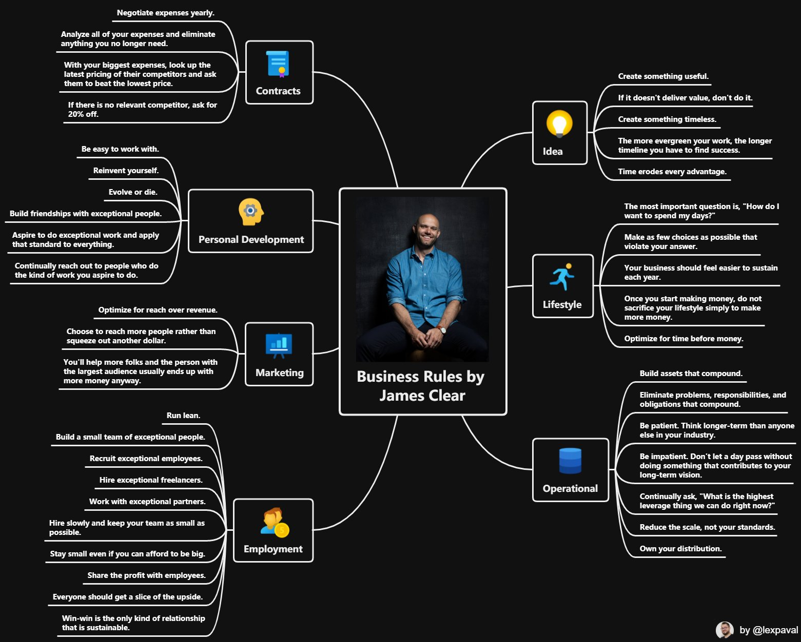

# Business

Es ist sinnvoller Geld in die Entwicklung eines großartigen Produktes zu stecken als in Marketing.
Beispiel:
- Betriko
- Tesla
Wenn man ein fantastisches Produkt hat, machen die Käufer die Werbung.
[Teslas secret weapon](https://www.youtube.com/watch?v=XgtXped_w4s)
- Geschäftsmodell: Vertrauen
- keine Kosten für die Umwelt produzieren
- geringe Kosten
- Mitarbeiter gut bezahlen
- sehr gutes Produkt 
- wenige Varianten

Es sollte viele kleine Teams geben, die sich mit bestimmten Themen beschäftigen. Ab 6-10 Personen pro Team wird es schwieriger sich abzustimmen. Verschiedene Teams suchen die beste Lösung für ein Problem und "treten gegeneinander an".

## Regeln

## Zielgruppe aufbauen

- Gelerntes Veröffentlichen (Blog, Videos, ...)
- Kostenlos Mehrwert liefern

### Links

- [Show Up Every Day for Two Years](https://seanwes.com/2015/show-up-every-day-for-two-years/)
- [Jesus Marketing](https://taylorpearson.me/jesusmarketing/)
- [Die 4 einzigen Wege, um mit deinem Blog wirklich Geld zu verdienen](https://www.chimpify.de/marketing/wege-um-mit-blog-geld-zu-verdienen/)
- [Was ist ein Tribe und warum ist er so wichtig?](https://www.chimpify.de/marketing/warum-tribe-wichtig/)

## Zitate

> If you want to Go fast Go alone, if you want to Go far go together.

> "With Product-led Growth, the idea is that rather than bringing users through an active sales team or aggressive marketing campaigns, you just focus on building your product - and ensure you make it great." - (Why You May Not Need a Sales Team)[https://posthog.com/blog/product-led-growth]

## Inspiration

- [Marvin](https://amazingmarvin.com/pricing) - Fokus auf User und großartiges Produkt (Pricing Questions)

## Journey

- [Tailwind CSS: From Side-Project Byproduct to Multi-Million Dollar Business](Tailwind CSS: From Side-Project Byproduct to Multi-Million Dollar Business)
- [This is the blueprint I've followed to build my own business/income in ~4 years](https://twitter.com/jdnoc/status/1291773397010087938)
- [A Bootstrapped SaaS Journey to 10K MRR](https://www.bannerbear.com/journey-to-10k-mrr/)
- [Building a business from a bedroom](https://www.mrdbourke.com/running-a-business-from-a-bedroom-11-months-in/)
- [A solo journey to 100k](https://draculatheme.com/pro/journey)

## Links

- [Be Good](http://paulgraham.com/good.html)
- [Your First 60 Days](https://microconf.gen.co/patrick-mckenzie/)
- [Pre-Brand](https://pre-brand.com/) - You don’t need a perfect brand, you need to keep moving
- [How I side project](https://thesephist.com/posts/how-i-side-project/)
- [How to finish your side project](https://hugozap.com/posts/how-to-finish-your-side-project/)
- [How To Sell](https://nabeelqu.co/post-selling)
- [Making a living as an independent maker](https://twitter.com/adamwathan/status/1296447318074568704)
- [Love flywheels? You're in luck!](https://twitter.com/lennysan/status/1295743085243060224)
- [Postmake](https://postmake.io/) - Tools and resources for your startups
- [Making The Leap](https://www.coreyhaines.co/blog/leap)
- [Microsolidarity Part 2](https://medium.com/microsolidarity/microsolidarity-part-2-a-theory-of-groups-and-groups-of-groups-7c6e7ce63eda)
- [building an audience](https://twitter.com/thisiskp_/status/1306614299218055169)
- [How to build a products](https://twitter.com/jackbutcher/status/1316747172306616321)
- [Never Compete on Price](https://medium.com/@tylerhakes/never-compete-on-price-c7709f29280)
- [Blogging for Devs](https://bloggingfordevs.com/)
- [23 rules to run a software startup with minimum hassle](https://www.joisig.com/rules-software-startup-minimum-hassle)
- [Growth Marketing](https://www.julian.com/guide/growth/intro)
- [Audience First](https://audiencefirst.link/contents/)
- [Selling digital products using Laravel](https://freek.dev/1789-selling-digital-products-using-laravel-part-1-intro-a-tour-of-spatiebe)
- [How to Make Sure Your Product Launch SELLS](https://www.youtube.com/watch?v=LSrcELpdgX8)
- [Finances needed to indie (2020)](https://twitter.com/yongfook/status/1328158466645475328)
- [What piece of financial advice is hard to explain to others?](https://qr.ae/pN9peS)
- [PopUp Business School](https://www.popupbusinessschool.co.uk/)
- [The 70% Rule](https://taylorpearson.me/fast/)
- [EntepreNERD](https://www.jackkinsella.ie/books/entreprenerd/marketing_for_programmers) - Marketing for programmers 
- [The Math That Explains How to Get Rich with Websites](https://fourpillarfreedom.com/website-math/)

### Blogs

### Videos

- [Josh Pigford - From Idea to $5k/mo in 5 Months](https://vimeo.com/94623532)
- [Starting a $400,000 Side Business in 1 Month](https://www.youtube.com/watch?v=NblHMZbYg-o)
- [How This CEO Built a Billion-Dollar Ethical Egg Business](https://www.youtube.com/watch?v=o8uhxZON1TU)