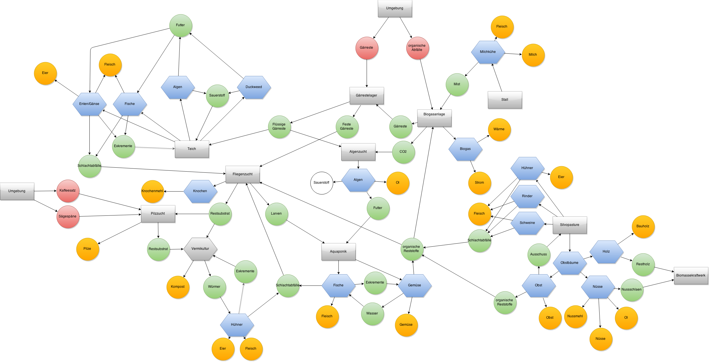

# Landwirtschaft

## Kompostieren

### Soldatenfliege

### Würmer

- [Vermicompost - A Living Soil Amendment](http://cwmi.css.cornell.edu/vermicompost.htm)

### Pilze

## Produktion

### Permakultur

### Regenerative Landwirtschaft

### Waldgarten

- [Seattle's Urban Food Forest Park!](https://www.youtube.com/watch?v=wH2ShQ-7hEI&t=629s)

## Bücher

- [For the love of Soil](https://www.fortheloveofsoil.org/educate)

## Betriebe

- [Permakultur Scheuerhof](https://www.permakultur-scheuerhof.de/)

